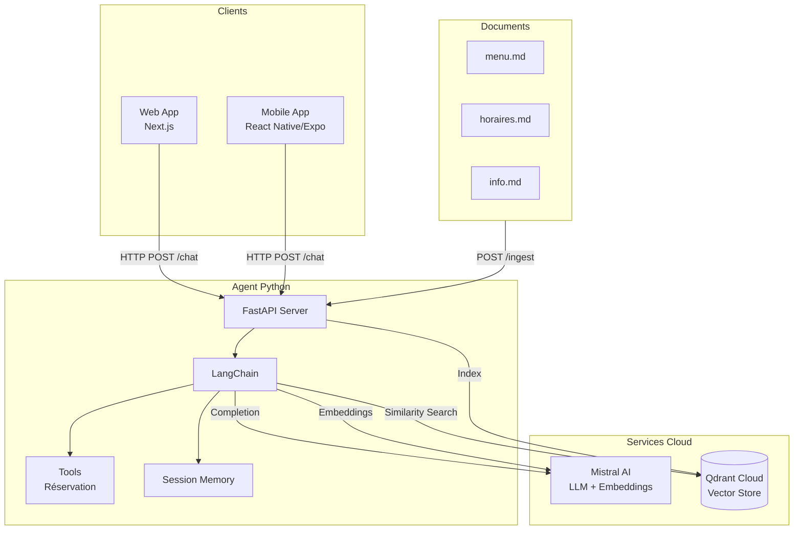
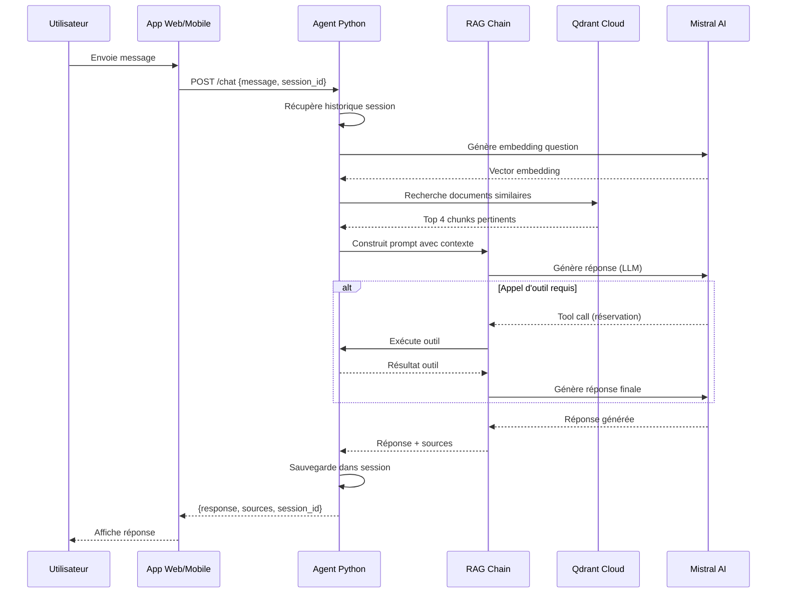
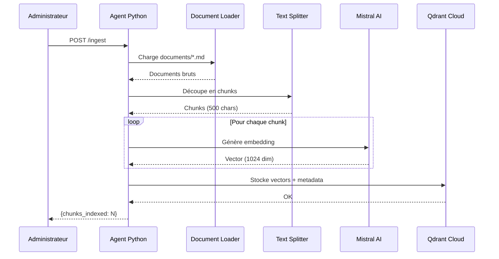

# Casa del Sabor - Chatbot IA

Chatbot intelligent pour le restaurant mexicain Casa del Sabor, utilisant RAG (Retrieval-Augmented Generation) avec LangChain, Mistral AI et Qdrant.

## Architecture



## Diagramme de séquence - Chat



## Diagramme de séquence - Ingestion



## Structure du projet

```
casaDelSabor/
├── web/                      # Frontend Next.js
│   ├── src/
│   │   ├── app/
│   │   │   ├── api/chat/     # API Route proxy
│   │   │   └── page.tsx
│   │   └── components/chat/ # Composants React
│   └── public/               # Assets statiques
│
├── agent/                    # Backend Python
│   ├── main.py               # FastAPI app
│   ├── config.py             # Configuration
│   ├── rag/
│   │   ├── chain.py          # RAG Chain + Agent
│   │   ├── tools.py          # Outils (réservation)
│   │   ├── memory.py         # Gestion sessions
│   │   ├── embeddings.py    # Mistral Embeddings
│   │   ├── vectorstore.py   # Client Qdrant
│   │   └── ingestion.py     # Ingestion documents
│   └── documents/            # Documents restaurant
│       ├── menu.md
│       ├── horaires.md
│       └── info.md
│
└── mobile/                   # App React Native/Expo
    ├── App.tsx
    └── src/
        ├── screens/
        ├── components/
        └── services/
```

## 📚 Documentation par module

Chaque module a sa propre documentation détaillée :

- **[Agent (Backend)](./agent/README.md)** - API Python FastAPI avec RAG
- **[Web App](./web/README.md)** - Application Next.js
- **[Mobile App](./mobile/README.md)** - Application React Native/Expo

## 🚀 Comment lancer l'application

Pour faire fonctionner l'application complète, vous devez lancer **3 composants** dans l'ordre suivant :

### Étape 1 : Agent Python (Backend)

Dans un premier terminal :

```bash
cd agent
cp .env.example .env          # Configurer les clés API (si pas déjà fait)
just install                  # Installer les dépendances
just ingest                   # Indexer les documents (première fois uniquement)
just dev                      # Lancer le serveur sur http://localhost:8000
```

✅ Le serveur backend est maintenant accessible sur `http://localhost:8000`

### Étape 2 : Frontend Web (Optionnel)

Dans un deuxième terminal :

```bash
cd web
npm install                  # Installer les dépendances (première fois uniquement)
npm run dev -- --hostname 0.0.0.0
```

✅ L'application web est maintenant accessible sur `http://localhost:3000`

### Étape 3 : App Mobile

Dans un troisième terminal :

```bash
cd mobile
npm install                  # Installer les dépendances (première fois uniquement)
npm run dev                  # Détecte automatiquement l'IP et lance Expo
```

Ensuite, sur votre téléphone :
1. Ouvrir **Expo Go**
2. Scanner le **QR code** affiché dans le terminal
3. L'application se charge automatiquement

---

## Démarrage rapide (référence)

### 1. Agent Python

```bash
cd agent
cp .env.example .env          # Configurer les clés API
just install
just ingest                   # Indexer les documents
just dev                      # Lancer le serveur
```

### 2. Frontend Web

```bash
cd web
npm install
npm run dev -- --hostname 0.0.0.0
```

### 3. App Mobile

#### Prérequis

1. **Installer Expo Go sur votre téléphone** :
   - **iPhone** : Télécharger [Expo Go](https://apps.apple.com/app/expo-go/id982107779) depuis l'App Store
   - **Android** : Télécharger [Expo Go](https://play.google.com/store/apps/details?id=host.exp.exponent) depuis le Google Play Store

2. **Installer Expo CLI** (si ce n'est pas déjà fait) :
   ```bash
   npm install -g expo-cli
   ```

3. **S'assurer que votre téléphone et votre ordinateur sont sur le même réseau Wi-Fi**

#### Connexion à votre compte Expo (optionnel mais recommandé)

Se connecter à votre compte Expo permet de :
- Synchroniser vos projets entre appareils
- Utiliser les services Expo (EAS Build, EAS Update, etc.)
- Accéder à vos projets depuis n'importe quel appareil

**Se connecter** :
```bash
cd mobile
npx expo login
```

Vous serez invité à entrer votre email et mot de passe Expo. Si vous n'avez pas de compte, créez-en un sur [expo.dev](https://expo.dev).

**Vérifier votre connexion** :
```bash
npx expo whoami
```

**Se déconnecter** :
```bash
npx expo logout
```

> **Note** : La connexion à un compte Expo n'est pas obligatoire pour développer localement avec Expo Go, mais elle est recommandée pour accéder à toutes les fonctionnalités d'Expo.

#### Lancement de l'application

**Mode développement (recommandé)** - Détecte automatiquement l'IP locale :
```bash
cd mobile
npm install
npm run dev
```

**Mode production** - Utilise l'URL de production configurée :
```bash
cd mobile
npm install
export EXPO_PUBLIC_PROD_API_URL=https://votre-api.up.railway.app
npm run prod
```

**Commandes alternatives** :
- `npm run android` - Lance sur Android avec détection automatique
- `npm run ios` - Lance sur iOS avec détection automatique
- `npm start` - Lance Expo sans configuration automatique (ancienne méthode)

Après avoir lancé `expo start`, vous verrez un QR code dans votre terminal. 

**Sur iPhone** :
- Ouvrir l'app **Appareil photo** native
- Scanner le QR code affiché dans le terminal
- L'app Expo Go s'ouvrira automatiquement avec votre application

**Sur Android** :
- Ouvrir l'app **Expo Go**
- Appuyer sur "Scan QR Code"
- Scanner le QR code affiché dans le terminal

#### Accéder au menu de développement Expo

Une fois l'application lancée sur votre téléphone, vous pouvez accéder au menu de développement Expo de plusieurs façons :

1. **Secouer le téléphone** (shake gesture) - Méthode principale
   - Sur iPhone : Secouer vigoureusement le téléphone
   - Sur Android : Secouer le téléphone ou appuyer sur le bouton menu
   - Le menu Expo apparaîtra avec les options : Reload, Debug, etc.

2. **Geste à trois doigts** (alternative)
   - Appuyer avec trois doigts sur l'écran

3. **Multitâche iOS**
   - Glisser depuis le bas de l'écran et maintenir
   - Revenir à l'app Expo Go depuis le sélecteur d'applications

#### Options du menu Expo

Le menu de développement Expo offre plusieurs fonctionnalités utiles :

- **Reload** : Recharge l'application sans redémarrer
- **Debug Remote JS** : Active le débogage JavaScript
- **Show Element Inspector** : Inspecte les éléments de l'interface
- **Performance Monitor** : Affiche les performances en temps réel
- **Settings** : Paramètres de développement

#### Dépannage

**Le menu Expo n'apparaît pas** :
- Vérifier que vous utilisez bien Expo Go (pas une build standalone)
- Secouer plus vigoureusement le téléphone
- Redémarrer l'app Expo Go
- Relancer le serveur Expo avec `npx expo start`

**L'application ne se charge pas** :
- Vérifier que le téléphone et l'ordinateur sont sur le même réseau Wi-Fi
- Vérifier que le serveur backend (agent) est bien lancé
- Vérifier l'URL de l'API dans `mobile/src/config/api.ts`

**Erreur de connexion** :
- Vérifier que le port utilisé par Expo n'est pas bloqué par un firewall
- Essayer de lancer avec `npx expo start --tunnel` pour utiliser le tunnel Expo

**Configuration de l'API** :

L'URL de l'API backend est maintenant détectée **automatiquement** ! Plus besoin de configuration manuelle.

**En développement** :
- Utilisez simplement `npm run dev` - l'IP locale est détectée automatiquement
- Le script configure automatiquement `EXPO_PUBLIC_API_URL` avec votre IP locale

**En production** :
- Utilisez `npm run prod` avec l'URL de production :
  ```bash
  export EXPO_PUBLIC_PROD_API_URL=https://votre-api.up.railway.app
  npm run prod
  ```

**Configuration manuelle (optionnel)** :

Si vous devez forcer une URL spécifique, la configuration suit cette priorité :

1. **Variable d'environnement `EXPO_PUBLIC_API_URL`** (priorité la plus haute)
2. **Variable dans `app.json` (extra.apiUrl)**
3. **Détection automatique du nom d'hôte** (macOS) - utilisée par `npm run dev`
4. **Fallback localhost**

**Vérifier votre IP locale** :
```bash
cd mobile
npm run get-ip
```

## Configuration

### Variables d'environnement (agent/.env)

| Variable | Description |
|----------|-------------|
| `MISTRAL_API_KEY` | Clé API Mistral AI |
| `QDRANT_URL` | URL Qdrant Cloud |
| `QDRANT_API_KEY` | Clé API Qdrant |

## Technologies

| Composant | Technologie |
|-----------|-------------|
| Frontend Web | Next.js 15, React, TypeScript |
| App Mobile | React Native, Expo |
| Backend | Python, FastAPI, LangChain |
| LLM | Mistral AI (mistral-small-latest) |
| Embeddings | Mistral AI (mistral-embed) |
| Vector Store | Qdrant Cloud |
| Package Manager | uv, npm |
| Task Runner | just |

## Fonctionnalités

- Chat conversationnel avec mémoire de session
- RAG sur les documents du restaurant (menu, horaires, infos)
- Outil de réservation (prototype)
- Interface WhatsApp-like
- Support Web et Mobile
